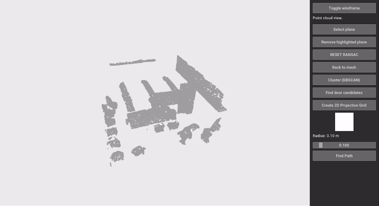
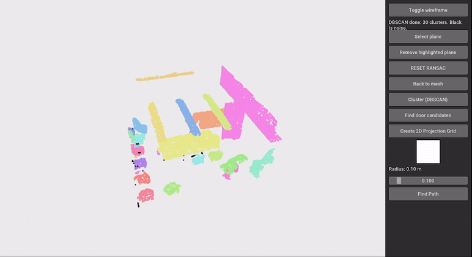
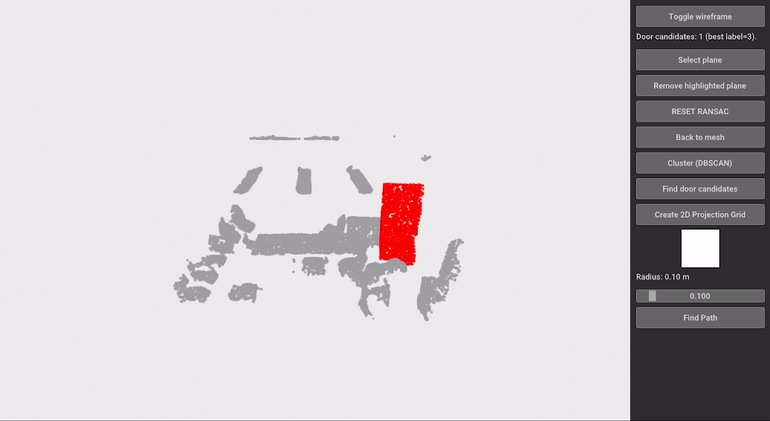
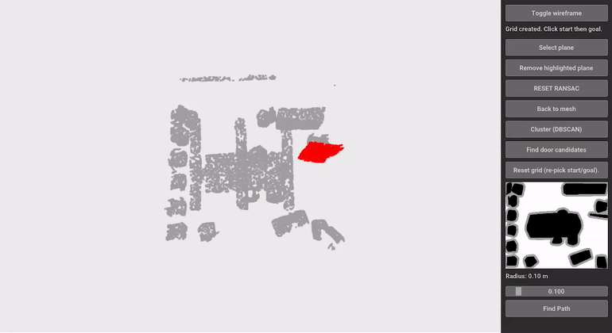

# Indoor Path Planning App (Open3D)

Open3D GUI for indoor path planning on 3D meshes / point clouds.
Originally developed as part of an M.Sc. course project at the [VVR group](https://vvr.ece.upatras.gr/en/).

## Demo

**Plane detection/removal on mesh (RANSAC)** 


**Sampling and plane detection/removal on point cloud (RANSAC)**


**Clustering (DBSCAN)**


**Door candidate detection** 


**2D occupancy grid creation**  


**Path planning (A\*)**  


## Overview

This app provides an interactive pipeline for indoor navigation on 3D meshes/point clouds. It supports mesh sampling, plane detection/removal, clustering-based obstacle extraction, 2D grid projection and obstacle expansion, and A* path planning, all inside an Open3D GUI.

## Features

- Mesh to point cloud sampling
- Plane detection/removal (RANSAC) on mesh or point cloud
- DBSCAN clustering for obstacle segmentation
- Door candidate detection (simple geometric heuristic)
- 2D occupancy grid projection + obstacle expansion (radius slider)
- A* path planning with start/goal selection on the grid
- Interactive visualization (mesh/wireframe, point cloud coloring, 2D grid view, 3D path overlay)

## Installation

Create and activate a Python environment (recommended), then install dependencies:

```bash
pip install -r requirements.txt
```

Tested with Python 3.12.12 on Windows.

## Usage

Run the app with a `.ply` mesh:

```bash
python app.py path/to/mesh.ply
```

## Demo data

The GIFs in this README were generated using a scene from the Stanford Large-Scale 3D Indoor Spaces dataset (S3DIS).
The dataset files are not included in this repository. A public mirror of S3DIS is available [here](https://cvg-data.inf.ethz.ch/s3dis/).


If you use S3DIS in academic work, please cite:
I. Armeni et al., "3D Semantic Parsing of Large-Scale Indoor Spaces", CVPR 2016.

## License

MIT License (see `LICENSE`).


